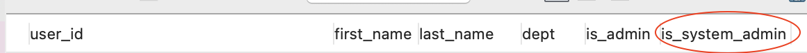
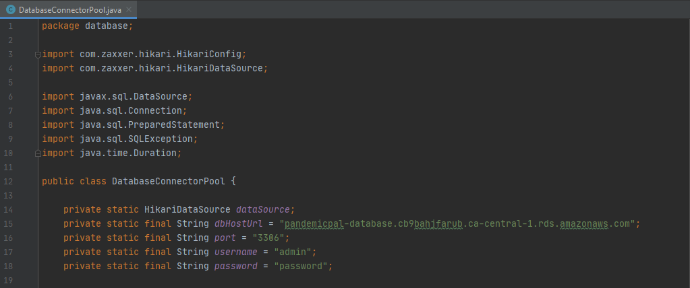

# Database Setup Instructions

### Step 1: Schema Setup

Connect to database using database credentials using a MySQL GUI (ie., MySQL Workbench). Then, run `CreateTable.sql` (located in `main` > `java` > `database` > `scripts`) to create the schema.

### Step 2: Assign System Admin

Using a MySQL GUI, update the `is_system_admin` column in the `Employees` table from `0` to `1` to assign the System Admin role to a particular user.

### Step 3: Connect application to your database

Open the `DatabaseConnectorPool.java` file located in `main` > `java` > `database`. Replace the `dbHostUrl`, `port`, `username` and `password` variables located above all the methods with the relevant credentials as shown in the image below.

### Appendix

Be sure to run the `ReservationsOffload.sql` and `MailOffload.sql` (both located in `main` > `java` > `database` > `scripts`) as often as necessary to archive Reservations that have passed and actioned Mail that have no open Mail Requests respectively.  
